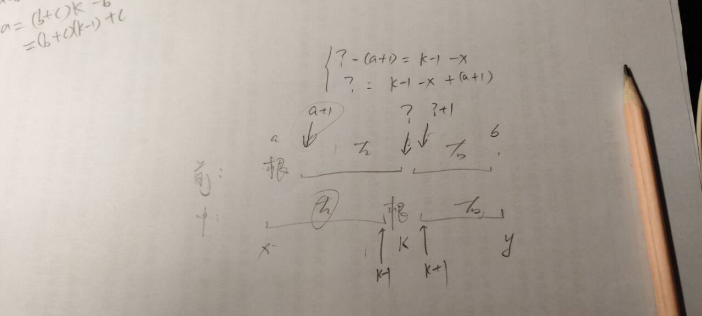
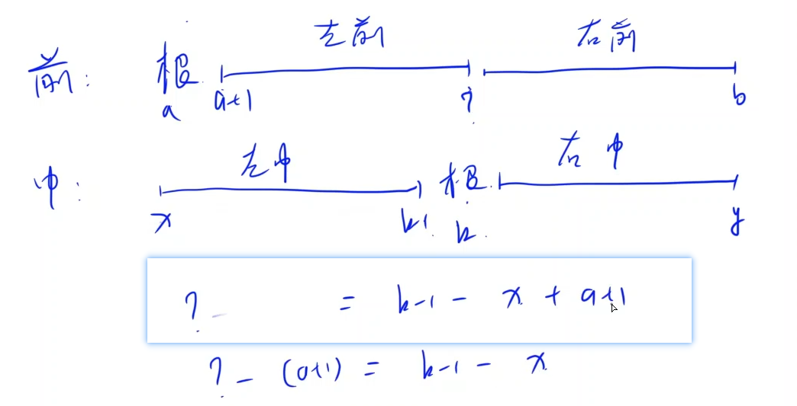

+++
author = "Wxn"
title = "给个offer"
date = "2024-04-24"
description = "Please read me first."
tags = [
	"Dilay",
]
categories = [
    "面试复盘",
]

+++

This article offers a sample of basic Markdown.
<!--more-->

# 正文开始

# 1.41. 包含min函数的栈

```cpp
//https://leetcode.cn/problems/bao-han-minhan-shu-de-zhan-lcof/description/
class MinStack {
public:
    /** initialize your data structure here. */
    //1.单调栈
    //2.主栈与辅助栈
    //3.1)push都要插入（如果辅助栈为空，或者辅助栈顶>=x，则辅助栈插入）
    //2)pop() 如果辅助栈顶 == 主栈顶，则辅助栈顶弹出，否者就只有主栈弹出
    //3)4)直接返回相应的栈
    MinStack() {
        
    }
    
    void push(int x) {
        
    }
    
    void pop() {
        
    }
    
    int top() {
        
    }
    
    int getMin() {
        
    }
};

/**
 * Your MinStack object will be instantiated and called as such:
 * MinStack obj = new MinStack();
 * obj.push(x);
 * obj.pop();
 * int param_3 = obj.top();
 * int param_4 = obj.getMin();
 */
```


# 2.35. 反转链表

```cpp
/**
 * Definition for singly-linked list.
 * struct ListNode {
 *     int val;
 *     ListNode *next;
 *     ListNode(int x) : val(x), next(NULL) {}
 * };
 */
 //https://leetcode.cn/problems/reverse-linked-list/
//难点：单链表要建立一个前驱节点
//关键点：画图
class Solution {
public:
    ListNode* reverseList(ListNode* head) {
        
    }
};
```


# 3.19. 二叉树的下一个节点

```cpp
/**
 * Definition for a binary tree node.
 * struct TreeNode {
 *     int val;
 *     TreeNode *left;
 *     TreeNode *right;
 *     TreeNode *father;
 *     TreeNode(int x) : val(x), left(NULL), right(NULL), father(NULL) {}
 * };
 */
 //这个是vip题目
//285. 二叉搜索树中的中序后继
//分类讨论:有右子树和没有右子树
//中序遍历
//情况1:这个点有右子树,那后继就是"右子树"最左边的那个
//情况2:这个点的右子树为空(且有父节点),当p有父节点且p等于p父节点的右儿子,那么p就赋值为p的父节点,最后返回p的父节点
class Solution {
public:
    TreeNode* inorderSuccessor(TreeNode* p) {
        
    }
};
```

# 4.34. 链表中环的入口结点

[142. 环形链表 II](https://leetcode.cn/problems/linked-list-cycle-ii/)

[LCR 022. 环形链表 II](https://leetcode.cn/problems/c32eOV/)

```cpp
/**
 * Definition for singly-linked list.
 * struct ListNode {
 *     int val;
 *     ListNode *next;
 *     ListNode(int x) : val(x), next(NULL) {}
 * };
 */
class Solution {
public:
    ListNode *entryNodeOfLoop(ListNode *head) {
        
    }
};
```

画图:数学证明:(b+c)表示n圈


```cpp
备份
class Solution {
public:
    ListNode *entryNodeOfLoop(ListNode *head) {
        auto first = head,slow = head;
        while(first && first->next && first->next->next)
        {
            first = first->next->next;
            slow = slow->next;
            if(first == slow)
            {
                first = head;
                while(first != slow)
                {
                    first = first->next;
                    slow = slow->next;
                }
                return first;
            }
        }
        return nullptr;
    }
};
```


# 5.77.翻转单词顺序

[151. 反转字符串中的单词](https://leetcode.cn/problems/reverse-words-in-a-string/)

```cpp
//先翻转整个句子
//再翻转单独的一个单词
//难点:在找到一段时,不要忘记边界
```


```cpp
void Reverse(int l ,int r,string& s)
{
    for(int i = l , j = r ;i < j ;i++,j--)swap(s[i],s[j]);
}
Reverse(0,s.size()-1,s);
等价于
reverse(s.begin()+0,s.begin()+s.size());//范围:[)

反转不是空格的那一段
```


# 6.18.重建二叉树

https://leetcode.cn/problems/zhong-jian-er-cha-shu-lcof/description/

```cpp
/**
 * Definition for a binary tree node.
 * struct TreeNode {
 *     int val;
 *     TreeNode *left;
 *     TreeNode *right;
 *     TreeNode(int x) : val(x), left(NULL), right(NULL) {}
 * };
 */
  //前:根左右
 //中:左根右
 //1.使用哈希表,快速的找到"一个元素在中序遍历的位置"
 //2.递归dfs(主函数直接返回)
 //1)递归参数:左右子树节点个数
 //2)递归内部:
 /*
 - 前序遍历:左>右 -> null
 - 根节点的值为前序遍历的第1个点 preorder[a]
 - 找到根节点在哈希表中的位置
 - 左右子树递归创建 范围画图
 */
class Solution {
public:
    TreeNode* buildTree(vector<int>& preorder, vector<int>& inorder) {
        
    }
};
```







# 7.21. 斐波那契数列

```cpp
//f[i] = f[i-1]+f[i-2]
class Solution {
public:
    int Fibonacci(int n) {
        
    }
};
```

# 8.78. 左旋转字符串

```cpp
//先把整个进行翻转
//再把前(总-个数),后两部分进行翻转
class Solution {
public:
    string leftRotateString(string str, int n) {
        
    }
};
```

# 9.87. 把字符串转换成整数

```cpp
//分步
//过滤掉行首空格
//long long
//判断这个数是不是负数
class Solution {
public:
    int strToInt(string str) {

    }
};
```

